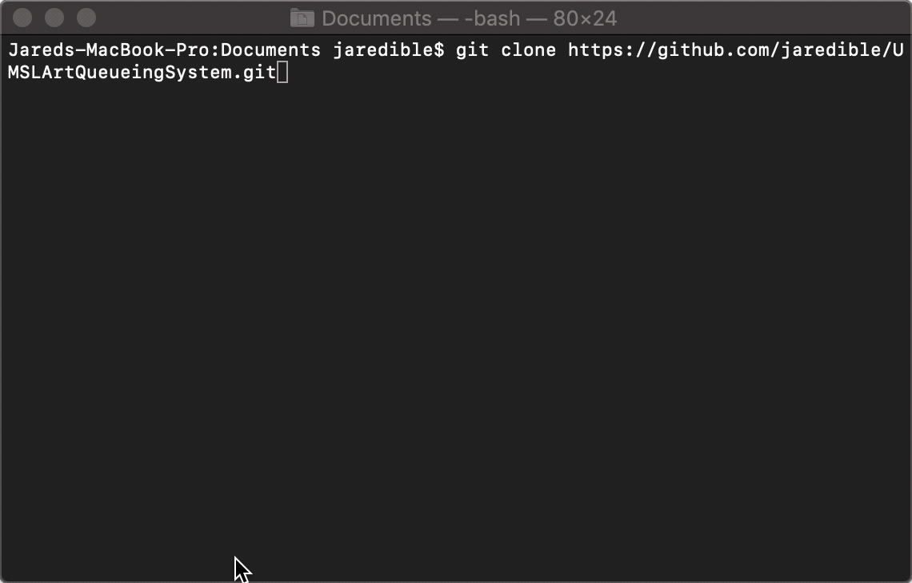
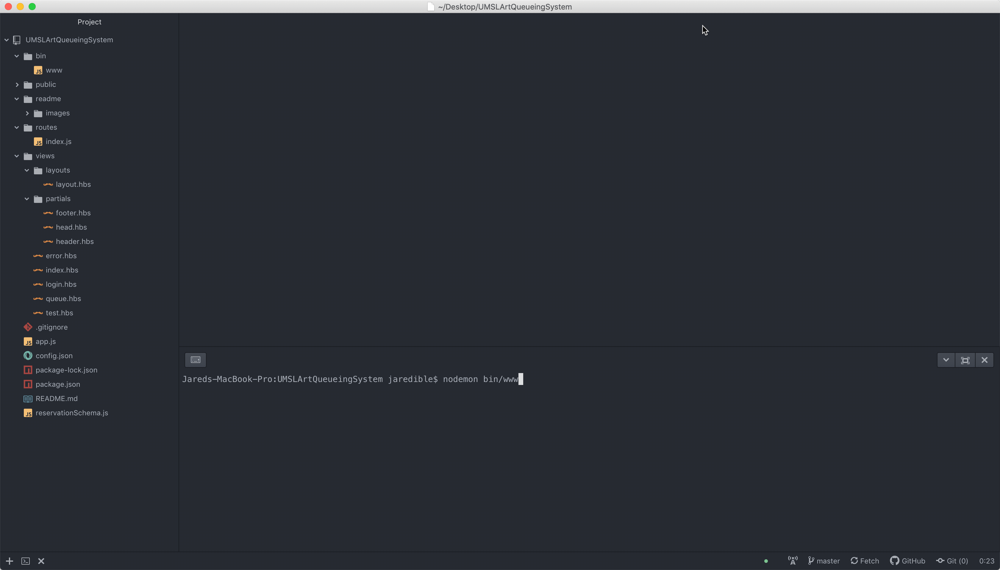

# UMSL's Art Department Queueing System

The purpose of this is to help facilitate the art departments resource scheduling.

## Getting Started

These instructions will get you a copy of the project up and running on your local machine for development and testing purposes. See deployment for notes on how to deploy the project on a live system.

### Prerequisites

* [Git](https://git-scm.com) - Version Control System
* [NPM and Node.js](https://www.npmjs.com/get-npm) - Node Package Manager and a Javascript runtime
* [MongoDB](https://www.mongodb.com/download-center/community) - Database

### Installing

Clone the repository to your machine.

```
git clone https://github.com/Jaredible/UMSLArtQueueingSystem.git
```

Change your directory to the download folder.

```
cd UMSLArtQueueingSystem
```

Install the required dependencies.

```
npm install
```



## Deployment

* Verify MongoDB is running on default port 27017.

Start the Node.js server.

```
node bin/www
```



## Built With

## Authors
* **Jared Diehl** - *Project Lead* - [Jaredible](https://github.com/Jaredible)
* *More coming soon...*

## Acknowledgments
*TODO*
